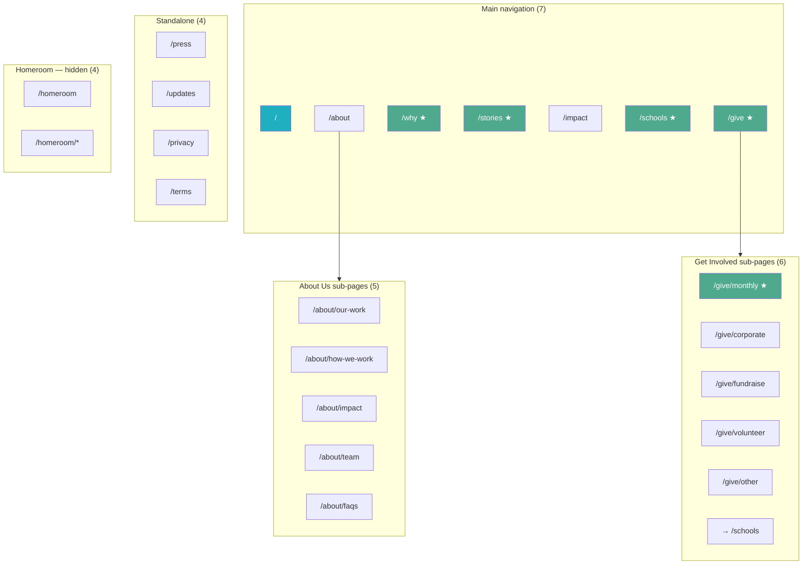

# The Contentment Foundation — Website Sitemap & Architecture

> **Status:** Draft — under review and finalization  
> **Domain:** [contentment.org](https://contentment.org)  
> **Last updated:** June 2026  
> **Current build:** Phase 1 homepage prototype in `site/index.html` (static HTML/CSS/JS)

This document is the canonical reference for site structure, URL planning, content scope, and build priorities. Slugs and page groupings are suggestions until the team signs off on final URLs.

---

## At a glance

| Category | Count |
|----------|------:|
| Top-level navigation pages | 7 |
| Sub-pages (nested under About & Get Involved) | 15 |
| Standalone utility pages | 4 |
| Hidden Homeroom (members-only) pages | 4 |
| Seasonal / campaign pages (not in permanent nav) | 2+ |
| **Approximate total URLs at launch** | **~30** |

---

## Phase 1 launch priorities

These pages are targeted for the first public release. All other pages may follow in Phase 2 or ship as stubs with “coming soon” treatment.

| Priority | Page | Suggested URL |
|----------|------|---------------|
| P1 | Home | `/` |
| P1 | Why Teacher Wellbeing | `/why` |
| P1 | Educator Stories (index) | `/stories` |
| P1 | For Schools | `/schools` |
| P1 | Get Involved — Monthly Giving (Homeroom) | `/give/monthly` |

> The current homepage prototype (`site/index.html`) already includes anchor sections that map to several Phase 1 themes: `#why`, `#impact`, `#how`, `#homeroom`. Multi-page routing will split and expand these into dedicated URLs.

---

## Information architecture

### Visual hierarchy

★ = Phase 1 priority

---

## Main navigation (7 pages)

| # | Label | URL | Phase | Purpose |
|---|-------|-----|-------|---------|
| 1 | **Home** | `/` | 1 | Primary entry point. Hero, mission, key proof points, primary CTAs (Homeroom, schools, stories). |
| 2 | **About Us** | `/about` | 2 | Organisation overview; gateway to sub-pages (our work, team, FAQs, impact). |
| 3 | **Why Teacher Wellbeing** | `/why` | 1 | Case for educator wellbeing — the problem, the science, why it matters now. |
| 4 | **Educator Stories** | `/stories` | 1 | Emotional and conversion driver. Global map, filters, links to individual profiles. |
| 5 | **Impact** | `/impact` | 2 | Organisation-wide outcomes, metrics, highlights. Links to stories; distinct from `/about/impact`. |
| 6 | **For Schools** | `/schools` | 1 | School partnership tiers, educator-first model, start-the-conversation CTA. |
| 7 | **Get Involved** | `/give` | 1 | Gateway to giving, volunteering, fundraising, and partnership paths. |

---

## About Us — sub-pages (5)

Parent: `/about`

| Label | URL | Content scope |
|-------|-----|---------------|
| **Our Work** | `/about/our-work` | Four pillars, methodology, the science behind the approach. |
| **How We Work** | `/about/how-we-work` | Educator-first model; what partnership looks like in practice. |
| **See Our Impact** | `/about/impact` | Key metrics, annual report, financials. |
| **Team & Board** | `/about/team` | Staff, board members, advisory council. |
| **FAQs** | `/about/faqs` | Common questions from donors, school partners, and people new to TCF. |

### Open decision — annual report & financials

- **Location:** `/about/impact` (confirmed direction).
- **Format:** TBD — embedded on the page vs. downloadable PDFs (or both).
- **Action:** Team to decide before build; affects CMS/asset workflow.

---

## Get Involved — sub-pages (6)

Parent: `/give`

| Label | URL | Content scope |
|-------|-----|---------------|
| **Monthly Giving (Homeroom)** | `/give/monthly` | Recurring donor signup; unlocks Homeroom member access. **Phase 1.** |
| **Become a School Partner** | `/schools` | Educator, School, and Network partnership tiers. *Shares URL with top-nav For Schools — single canonical page.* |
| **Become a Corporate Partner** | `/give/corporate` | Brand and workplace giving programmes. |
| **Fundraise** | `/give/fundraise` | Run your own campaign on behalf of the Foundation. |
| **Volunteer** | `/give/volunteer` | Skills-based, facilitation, and events volunteering. |
| **More Ways to Give** | `/give/other` | One-time gifts, stock donations, legacy and planned giving. |

### Integration note

Monthly giving CTAs across the site (nav pill, hero, Homeroom section) should resolve to `/give/monthly` and ultimately wire to the Keela donation flow when URLs are available.

---

## Educator Stories — structure

| Type | URL pattern | Description |
|------|-------------|-------------|
| **Stories index** | `/stories` | Global map with pins by country. Filters: region, theme, school type. Standalone top-nav item. |
| **Individual story** | `/stories/[educator-name]` | Long-form profile: photo, quote, school context, ripple impact. |

### Recommendation (approved direction)

**Keep Educator Stories as a standalone top-nav page at `/stories`** — do not nest under `/impact`.

| Rationale |
|-----------|
| Stories are the primary emotional and conversion driver for donors and school partners. |
| Burying them inside Impact reduces visibility and discoverability. |
| `/impact` should link to stories; stories should not depend on Impact for navigation. |

### Open question (for team sign-off)

| Question | Recommendation |
|----------|----------------|
| Should Educator Stories live at `/stories` or nest under `/impact`? | **Standalone at `/stories`** (see above). |

---

## Standalone utility pages (4)

Not in main nav; linked from footer, legal flows, press outreach, and campaigns.

| Label | URL | Purpose |
|-------|-----|---------|
| **Press & Media** | `/press` | Media coverage, brand assets, press kit, journalist contact. |
| **Newsletter Signup** | `/updates` | Dedicated opt-in page (separate from footer widget). |
| **Privacy Policy** | `/privacy` | Privacy policy. |
| **Terms of Use** | `/terms` | Terms of use. |

---

## Hidden pages — Homeroom (members only)

**Access:** Password-gated. Not linked anywhere on the public site.

**Distribution:** Links shared via newsletter, social media, and post-donation flows so members can continue exploring beyond the gated area.

| Label | URL | Purpose |
|-------|-----|---------|
| **Homeroom Hub** | `/homeroom` | Landing for monthly givers: what's available, upcoming events, key announcements. |
| **Additional member pages** | `/homeroom/*` | Up to 3 additional gated pages (content TBD). |

> **Count:** 4 Homeroom URLs total (hub + 3 sub-pages). Exact slugs and content briefs to be defined with the Homeroom product owner.

---

## Seasonal & campaign pages

These are **not** part of permanent site navigation. Built for specific moments, promoted via email, social, and paid channels. Archived or redirected when the campaign ends.

**Process:** Each campaign requires its own brief, design, approval, and QA — **at least 4–6 weeks before go-live**.

---

### 10th Anniversary Celebration

| Field | Detail |
|-------|--------|
| **Suggested URLs** | `/10years`, `/decade`, or `/ten` (team to pick one canonical slug) |
| **Purpose** | Mark the milestone; deepen donor connection; attract new supporters; generate press; create a shareable community moment. |

**Suggested content:**

- Letter from the founder / CEO *(pull from annual report)*
- Timeline of the organisation's journey *(2015–2025)*
- Impact numbers across the decade *(pull from annual report)*
- Video or photo stories from teachers, schools, and countries served
- Anniversary fundraising ask — e.g. *"Help us reach our next 10,000 teachers"*
- Wall of gratitude — supporters, partners, teachers who shaped the decade
- Press and media mentions over the years

**Post-campaign:** Consider keeping as a permanent archive (e.g. redirect to `/about/our-story` or a dedicated evergreen URL). Anniversary pages often become valuable long-term trust-building content.

---

### Contentment Festival — sales page

| Field | Detail |
|-------|--------|
| **Suggested URLs** | `/festival`, `/fest`, or `/contentmentfest` |
| **Versioning (if annual)** | `/festival/2025`, `/festival/2026`, etc. — archive past editions instead of overwriting |
| **Purpose** | Drive ticket sales and registrations; communicate value, speakers, and experience; convert email and social audiences. |

**Suggested content:**

- Hero: dates, location, primary CTA (Tickets / Register)
- What is the Contentment Festival — the experience and the why
- How to get involved
- Volunteer handbook + call to action
- Speaker and facilitator lineup
- Schedule / programme overview
- Festival-specific FAQs
- Sponsor and partner logos
- Email capture for waitlist or updates *(if the festival is free, newsletter signup should be required)*

**Analytics & tracking:**

- Dedicated analytics for the festival page
- UTM parameters on every channel driving traffic
- Ad credit / paid promotion to be evaluated with remaining budget

---

## Complete URL inventory

### Permanent site (~26 URLs)

| URL | Nav visibility | Phase |
|-----|----------------|-------|
| `/` | Main nav | 1 |
| `/about` | Main nav | 2 |
| `/about/our-work` | About sub-nav | 2 |
| `/about/how-we-work` | About sub-nav | 2 |
| `/about/impact` | About sub-nav | 2 |
| `/about/team` | About sub-nav | 2 |
| `/about/faqs` | About sub-nav | 2 |
| `/why` | Main nav | 1 |
| `/stories` | Main nav | 1 |
| `/stories/[educator-name]` | Linked from index | 1+ |
| `/impact` | Main nav | 2 |
| `/schools` | Main nav | 1 |
| `/give` | Main nav | 1 |
| `/give/monthly` | Get Involved sub-nav | 1 |
| `/give/corporate` | Get Involved sub-nav | 2 |
| `/give/fundraise` | Get Involved sub-nav | 2 |
| `/give/volunteer` | Get Involved sub-nav | 2 |
| `/give/other` | Get Involved sub-nav | 2 |
| `/press` | Footer / utility | 2 |
| `/updates` | Footer / utility | 2 |
| `/privacy` | Footer / legal | 2 |
| `/terms` | Footer / legal | 2 |
| `/homeroom` | Hidden (gated) | 2 |
| `/homeroom/*` (×3) | Hidden (gated) | 2 |

### Campaign / temporal (not in launch count)

| URL | Type |
|-----|------|
| `/10years` (or `/decade`, `/ten`) | Anniversary campaign |
| `/festival` (or `/festival/YYYY`) | Festival sales |

---

## Open questions & decisions log

| # | Topic | Options | Status |
|---|-------|---------|--------|
| 1 | Educator Stories placement | Standalone `/stories` vs. nested under `/impact` | **Recommend standalone** — pending sign-off |
| 2 | Final URL slugs | All URLs in this doc are suggestions | Under review |
| 3 | Annual report & financials | Embedded vs. PDF download vs. both | Open |
| 4 | Anniversary URL | `/10years`, `/decade`, `/ten` | Open |
| 5 | Festival URL & versioning | `/festival` vs. `/festival/YYYY` | Open |
| 6 | Homeroom sub-page content | 3 gated pages beyond hub | TBD |
| 7 | `/impact` vs. `/about/impact` | Two impact surfaces — clarify content split to avoid duplication | Needs content brief |

---

## Notes for the build team

### Scope

- **~30 URLs** at launch, including sub-pages and hidden Homeroom pages.
- **Phase 1** focuses on five user-facing priorities (see table above); remaining pages can ship incrementally.
- All URL slugs are **provisional** until brainstorm and team agreement.

### Technical context (current repo)

| Item | Detail |
|------|--------|
| Stack (prototype) | Static HTML, CSS, vanilla JS — no build step |
| Entry point | `site/index.html` |
| Design tokens | Newsreader, Inter, Varela Round; teal/ocean/deep/green/paper palette (see `README.md`) |
| Donations | Keela integration pending — CTAs currently placeholder `#` |
| Newsletter | Form present; backend not wired |
| Deploy | Upload `site/` to static host; root domain serves `index.html` |

### Content & UX principles

1. **Stories first** — treat Educator Stories as a first-class nav item and conversion path.
2. **Schools & give paths** — `/schools` is shared between main nav and Get Involved; one page, two entry points.
3. **Homeroom** — monthly giving is both a donation product and a gated member experience; `/give/monthly` is the public funnel, `/homeroom` is the member hub.
4. **Campaign pages** — brief, design, approve, and QA 4–6 weeks ahead; plan archive/redirect strategy before launch.
5. **Accessibility** — current prototype respects `prefers-reduced-motion`; carry forward to all new pages.

### Distinction: two “impact” URLs

| URL | Audience | Focus |
|-----|----------|-------|
| `/impact` | General public (main nav) | Organisation outcomes, highlights, link to stories |
| `/about/impact` | Donors, due-diligence visitors (About section) | Metrics, annual report, financials |

Content teams should define clear boundaries so these pages do not duplicate each other.

---

## Related documents

| Document | Location |
|----------|----------|
| Messaging & copy brief | [`MESSAGING-AND-COPY.md`](./MESSAGING-AND-COPY.md) |
| Evidence & research | [`EVIDENCE-AND-RESEARCH.md`](./EVIDENCE-AND-RESEARCH.md) |
| Voice & tone guide | [`VOICE-AND-TONE.md`](./VOICE-AND-TONE.md) |
| Docs index | [`README.md`](./README.md) |
| Planning & execution | [`planning/`](./planning/) |
| Homepage build & dev notes | [`README.md`](../README.md) |
| Local site reference | [`site/README.txt`](../site/README.txt) |
| Homepage prototype | [`site/index.html`](../site/index.html) |

---

## Changelog

| Date | Change |
|------|--------|
| 2026-06 | Initial architecture document created from planning brief. Status: draft, under review. |
| 2026-06 | Cross-linked with Messaging & Copy brief and docs index. |
| 2026-06 | Messaging brief renamed to `MESSAGING-AND-COPY.md`. |
