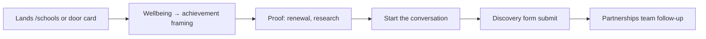
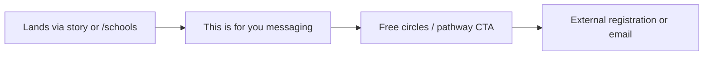
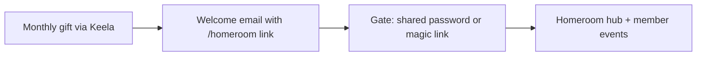

# Product Requirements Document — contentment.org

> **Status:** Draft  
> **Last updated:** June 2026  
> **Product:** The Contentment Foundation public website  
> **UI/UX constraint:** Locked to current prototype (`site/index.html`) and approved planning docs. No visual redesign in v1.

Related: [Website Architecture](../WEBSITE-ARCHITECTURE.md) · [Messaging & Copy](../MESSAGING-AND-COPY.md) · [Feature Tickets](./FEATURE-TICKETS.md)

---

## 1. Executive summary

The Contentment Foundation needs a new **contentment.org** that converts visitors into Homeroom members, school partners, and movement participants. The site tells one story: **teacher wellbeing is the antidote** — and TCF delivers it at scale.

Today we have a **single-page homepage prototype** (static HTML/CSS/JS). This PRD defines the full product through Phase 1 MVP and what follows.

---

## 2. What the product is

A **marketing and conversion website** for a global nonprofit. It is not a learning management system, donor portal, or educator app. It:

- Educates three audiences on why teacher wellbeing matters
- Proves credibility with stats, research, and educator stories
- Converts visitors to **Homeroom** monthly giving (from $5/month)
- Routes school leaders to a **discovery conversation**
- Routes educators to **circles and pathways**
- Hosts campaign pages (Festival, 10th Anniversary) on a separate cadence
- Gates **Homeroom member content** behind simple access control (Phase 2)

> **Homeroom naming:** Two distinct pages share the "Homeroom" name. `/give/monthly` is the **public conversion page** — where visitors join the movement. `/homeroom` is the **gated member hub** — password-protected, not publicly linked, Phase 2. The messaging brief describes the public conversion page. This PRD and the feature tickets treat them separately to avoid confusion.

---

## 3. Who it is for

| Persona | Inner voice | Primary goal on site |
|---------|-------------|----------------------|
| **Future member** (primary) | "I remember a great teacher. Teachers are running on empty." | Join Homeroom from $5/month |
| **School leader** | "My teachers are struggling. I need outcomes, not fluff." | Start the conversation (discovery form) |
| **Educator** | "I'm exhausted. Is this another thing on my plate?" | Join a circle / explore educator pathway |
| **Homeroom member** (Phase 2) | "I'm part of this now." | Access hub, events, member resources |
| **Press / donor due diligence** | "Is this org legitimate?" | Impact, annual report, press kit |

---

## 4. Problem it solves

| Problem | How the site solves it |
|---------|------------------------|
| TCF's impact is invisible to cold visitors | Belief journey, proof points, educator stories, research citations |
| Donation path is unclear | Single primary CTA sitewide: Join Homeroom; `/give/monthly` conversion page |
| School leaders don't see wellbeing as achievement-linked | For Schools page with renewal data, Harvard/Durlak evidence |
| Stories are buried | Standalone `/stories` in main nav |
| Members have no digital home | Password-gated `/homeroom` (Phase 2) |
| Campaign moments lack dedicated landing pages | Temporal URLs (`/festival`, `/10years`) with tracking |

---

## 5. Core features

### Must-have (Phase 1 MVP — launch blockers)

| # | Feature | Description |
|---|---------|-------------|
| F1 | **Multi-page site shell** | Shared nav, footer, design system from prototype across routes |
| F2 | **Homepage** | Port existing `site/index.html` to `/`; wire real links |
| F3 | **Why Teacher Wellbeing** | Long-form argument page (`/why`); belief steps 2–3 |
| F4 | **Educator Stories index** | `/stories` with map/filters (MVP: list + 3–5 story pages acceptable if map is Phase 1.1) |
| F5 | **For Schools** | `/schools`; partnership tiers + discovery form |
| F6 | **Get Involved + Homeroom giving** | `/give` gateway + `/give/monthly` functional scaffold with Keela checkout wired; full editorial copy and 100 Hearts founding treatment are F17 |
| F7 | **Keela donation integration** | All Homeroom CTAs resolve to live recurring donation flow |
| F8 | **Newsletter signup** | Footer + `/updates`; connected to email provider |
| F9 | **Analytics & UTM** | Page views, conversion events, campaign attribution |
| F10 | **Accessibility baseline** | WCAG 2.1 AA targets; `prefers-reduced-motion` preserved |
| F11 | **Legal pages** | `/privacy`, `/terms` (can be simple v1) |
| F12 | **Mobile navigation** | Full mobile menu (prototype has button only) |

### Should-have (Phase 1.5 — soon after launch)

| # | Feature | Description |
|---|---------|-------------|
| F13 | **Individual story pages** | `/stories/[slug]` template; CMS or markdown-driven |
| F14 | **Get Involved sub-pages** | Corporate, fundraise, volunteer, other ways to give |
| F15 | **School discovery form backend** | Submissions stored + notification to partnerships team |
| F16 | **Events & Experiences** | `/events` per messaging brief; Festival block + email capture. Note: messaging brief treats this as a core page (Belief Step 5 — belonging). Classify should-have to protect MVP scope, but target as close to launch as possible. |
| F17 | **Homeroom conversion page** | Full `/give/monthly` copy per messaging brief (100 Hearts founding) |
| F18 | **SEO** | Meta, OG tags, sitemap.xml, structured data for org |

### Nice-to-have (Phase 2+)

| # | Feature | Description |
|---|---------|-------------|
| F19 | **About section** (5 sub-pages) | `/about/*` |
| F20 | **Impact page** | `/impact` (main nav, general public) — org outcomes, highlights, link to stories. Distinct from `/about/impact` (About section, donors/due-diligence) — metrics, annual report, financials. Content teams must define the boundary before build to avoid duplication. |
| F21 | **Homeroom gated hub** | `/homeroom` password or member auth |
| F22 | **Press & media kit** | `/press` with downloadable assets |
| F23 | **Interactive stories map** | Full global map with country pins |
| F24 | **Campaign builder workflow** | Template for `/festival/YYYY`, `/10years` |
| F25 | **i18n** | Local language with inline translation where source material uses it |

---

## 6. User flows

### Flow A · Cold visitor → Homeroom member (primary)

```mermaid
flowchart LR
    A[Lands on any page] --> B[Orientation line + belief step]
    B --> C{Convinced?}
    C -->|Not yet| D[/why]
    C -->|Yes| E[/give/monthly]
    D --> E
    E --> F[Keela checkout]
    F --> G[Thank you + Homeroom welcome email]
```

### Flow B · School leader



### Flow C · Educator



### Flow D · Homeroom member (Phase 2)



---

## 7. MVP definition (Phase 1)

**Ship when:**

| Criterion | Detail |
|-----------|--------|
| **Pages live** | `/`, `/why`, `/stories` (index + minimum 1 story), `/schools`, `/give`, `/give/monthly`, `/privacy`, `/terms` |
| **UI** | Matches `site/index.html` design system — no new visual direction |
| **Copy** | Follows [Messaging & Copy](../MESSAGING-AND-COPY.md); orientation line on every page |
| **Donations** | Keela live for $5/$25/$100 tiers (pending tier decision) |
| **Newsletter** | Form submits to email provider |
| **CTAs** | No placeholder `href="#"` on primary conversion paths |
| **Analytics** | GA4 or Plausible + conversion events on Homeroom CTA clicks and form submits |
| **Performance** | Lighthouse performance ≥ 85 on mobile for homepage |
| **A11y** | Reduced motion works; keyboard nav on pillars; form labels present |

**MVP does not include:** Homeroom gated area, full About section, interactive map, campaign pages, member accounts.

---

## 8. Success metrics

| Metric | Target (90 days post-launch) | How measured |
|--------|------------------------------|--------------|
| Homeroom conversion rate | Establish baseline; improve 20% vs. old site | Keela + analytics funnel |
| Monthly recurring revenue | Track new MRR from web channel | Keela |
| `/why` share rate | ≥ 5% of `/why` sessions use Share CTA | Analytics event |
| School form submissions | ≥ 10 qualified leads/month | Form backend |
| Newsletter signups | ≥ 200/month from site | Email provider |
| Bounce rate on homepage | < 55% | Analytics |
| Page load (LCP) | < 2.5s on 4G | Lighthouse / RUM |
| Accessibility | Zero critical a11y issues in audit | axe / manual |

**North star (qualitative):** A first-time visitor can explain TCF to a friend after reading one page — per the three-question front-door test in the messaging brief.

---

## 9. Deliberately NOT in version one

| Out of scope | Reason |
|--------------|--------|
| Visual redesign or new design system | Locked to current prototype |
| Custom donor portal / login accounts | Keela handles payments; Homeroom gate is Phase 2 |
| Educator LMS or course delivery | Out of product scope |
| Full CMS for all ~30 pages | Phase 1 is template + key pages; expand later |
| Native mobile app | Web only |
| Multi-language site | English first; inline cultural terms only |
| Real-time chat / chatbot | Not in brief |
| Member-only event RSVP system | Events page Phase 1.5; RSVP may link externally first |
| Custom CRM | Use Keela + email provider + form notifications |
| User-generated content | Stories are editorially curated |
| A/B testing platform | Manual iteration post-launch |
| Blog | Newsletter + stories replace blog for now |

---

## 10. Dependencies & open decisions

| Item | Impact | Owner | Risk |
|------|--------|-------|------|
| Keela donation URLs | Blocks F7 (Keela integration) and F6/F17 (Homeroom page wiring) — build page UI without them, wire as final step | Finance / ops | High |
| Homeroom tier amounts ($5/$25/$100 vs $25/$50/$100) | Copy + Keela products | Leadership | High |
| EIN for Homeroom FAQ | Legal copy on `/give/monthly` | Finance | Medium |
| Story content + photos | `/stories` Phase 1 launch — minimum 3 stories required; if late, launch with holding state | Programs / comms | High |
| School form destination | Flodesk vs Keela vs custom API vs GCP | Partnerships + eng | Medium |
| Final URL slugs | Routing, redirects | Team sign-off | Medium |
| `/impact` vs `/about/impact` content boundary | Without a brief for each, pages will duplicate; content team must define scope before F20 build | Content / product | Medium |
| Event calendar dates | Blocks F16 (Events page); cannot build event cards without confirmed dates and details | Events / comms | Medium |

> **Blocking chain to watch:** Keela URLs (finance) → TICKET-060 → TICKET-051 (Homeroom conversion page). This is the most critical conversion path on the site. Escalate early if Keela URLs are delayed.

> **Editorial launch risk:** Story content from comms is an external dependency with no engineering workaround. If content is not ready at Phase 1 launch, `/stories` ships as a stub. Assign a content deadline 3 weeks before planned launch.

See [Messaging & Copy §11](../MESSAGING-AND-COPY.md) for full open decisions list.

---

## 11. Related documents

| Document | Location |
|----------|----------|
| Feature tickets | [FEATURE-TICKETS.md](./FEATURE-TICKETS.md) |
| Technical architecture | [TECHNICAL-ARCHITECTURE.md](./TECHNICAL-ARCHITECTURE.md) |
| Frontend spec (locked UI) | [FRONTEND-SPECIFICATION.md](./FRONTEND-SPECIFICATION.md) |
| Site map | [WEBSITE-ARCHITECTURE.md](../WEBSITE-ARCHITECTURE.md) |
| Messaging brief | [MESSAGING-AND-COPY.md](../MESSAGING-AND-COPY.md) |

---

## Changelog

| Date | Change |
|------|--------|
| 2026-06 | Initial PRD for Phase 1 MVP. |
| 2026-06 | Added Homeroom naming clarification (Section 2). Clarified F6 vs F17 scope split. Noted Events page messaging brief alignment (F16). Added /impact vs /about/impact content boundary to F20. Expanded Section 10 with risk levels, blocking chain note, and editorial launch risk note. |
