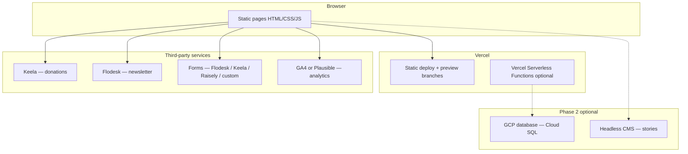

# Technical Architecture Document — contentment.org

> **Status:** Draft  
> **Last updated:** June 2026  
> **Contact:** somesh@contentment.org  
> **Constraint:** Preserve existing UI from `site/index.html`; evolve structure, routing, and integrations only.

Related: [PRD](./PRD.md) · [Frontend Spec](./FRONTEND-SPECIFICATION.md) · [Security & Access](./SECURITY-AND-ACCESS.md)

---

## 1. Architecture overview

contentment.org is a **static-first marketing site** deployed on **Vercel**, with **third-party services** for payments, email, and forms. **No database is required for Phase 1 MVP** — Flodesk, Keela, Raisely, and similar tools hold subscriber and lead data.



**Design principle:** Minimize moving parts for a small nonprofit team. Prefer managed services (Flodesk, Keela, Raisely) over a custom database until you have a clear reason to own the data in-house.

---

## 2. Recommended tech stack

| Layer | Choice | Reasoning |
|-------|--------|-----------|
| **Markup & style** | HTML + CSS (extracted from prototype) | Already built; team-approved UI; no redesign |
| **Interactivity** | Vanilla JavaScript (ES modules optional) | Prototype patterns work; no framework lock-in for marketing pages |
| **Build tool (recommended)** | [Astro](https://astro.build) 4.x | Multi-page routing, shared layouts, static output; can embed existing HTML/CSS as-is |
| **Alternative** | Multi-file static HTML | Zero build step; higher duplication cost across ~30 URLs |
| **Hosting** | **Vercel** (confirmed) | Preview deploys per PR, HTTPS, custom domain, edge middleware for Homeroom gate |
| **CDN / assets** | Vercel CDN + `public/assets/` | Same deploy as site; no separate CDN needed at launch |
| **Donations** | Keela (existing) | Recurring Homeroom gifts, receipts, tax |
| **Newsletter** | **Flodesk** (confirmed) | Subscriber list, campaigns, automations |
| **Forms** | **Flexible per form** (see §2.1) | Third-party embed, provider-native forms, or custom build |
| **Database** | **GCP Cloud SQL** (optional — Phase 2+) | Only when custom forms or member auth need a system of record you control |
| **Analytics** | Plausible or GA4 | Campaign UTM support required for Festival |
| **CMS (Phase 1.5+)** | Markdown files in repo (Phase 1) → Sanity (Phase 1.5) | Phase 1: stories authored as JSON/markdown, deploy required per update. Phase 1.5: migrate to Sanity when content team needs self-service editing without engineering. |
| **Homeroom gate (Phase 2)** | Vercel edge middleware + shared password, or magic link via GCP-backed API | Simple password first |
| **Version control** | Git + GitHub | Vercel preview deploys on PRs |

### 2.1 Forms strategy (flexible per use case)

Not every form needs the same backend. Pick the simplest option that stores data where the team already works.

| Form | Recommended options | Data lands in |
|------|---------------------|---------------|
| **Newsletter** | Flodesk embed or Flodesk API via Vercel function | Flodesk |
| **Homeroom / giving** | Keela hosted checkout (link, not a form) | Keela |
| **School discovery** | Custom UI styled like site → Flodesk form, Keela form, **or** custom POST → Vercel API → GCP | Flodesk / Keela / GCP |
| **Fundraise** | Raisely campaign embed or link | Raisely |
| **Festival waitlist** | Flodesk segment or Keela signup | Flodesk / Keela |
| **Volunteer interest** | Flodesk, Keela, or custom | Per choice above |

**Custom-built forms:** Keep the prototype input styles (`.news input`). Submit to a **Vercel Serverless Function** (`/api/...`) that validates, rate-limits, and either forwards to Flodesk/Keela API or writes to **GCP Cloud SQL**. Use custom build only when you need full UI control *and* provider embeds are not enough.

### 2.2 When do we need a GCP database?

**Short answer: you probably don't for launch.**

| Phase 1 MVP — no DB needed | Why |
|----------------------------|-----|
| Static pages | HTML/Astro files in the repo |
| Newsletter signups | Flodesk is the system of record |
| Donations | Keela is the system of record |
| Most forms | Flodesk, Keela, or Raisely forms store submissions in those products |
| Educator stories | `stories.json` or markdown in repo |

**When GCP Cloud SQL becomes worth it:**

| Trigger | What the DB gives you |
|---------|------------------------|
| **Custom school form** with internal workflow (status: new → contacted → qualified) | Query and assign leads without exporting from Flodesk |
| **Homeroom magic-link auth** | Store verified member emails synced from Keela |
| **Single dashboard** across Keela + form data | Your own tables if integrations are insufficient |
| **Audit / compliance** | Long-term retention rules you control |
| **High-volume API** | Rate limiting + deduplication server-side |

**If none of the above apply at launch, skip GCP entirely.** You can add Cloud SQL later without changing the static site — only the Vercel API routes change.

**GCP service:** **Cloud SQL (PostgreSQL)** — familiar relational model, matches schema in §4.3. Alternative: Firestore if you prefer document store (not required for this site).

### Why not Next.js / React SPA for v1?

The approved UI is a static document with scroll animations. A SPA adds bundle size, hydration complexity, and SEO risk without benefit for Phase 1. Astro (or plain static) gives multi-page + shared chrome with minimal change to current CSS.

### CMS recommendation rationale

**Phase 1:** Keep stories in `src/data/stories.json` and individual Markdown files. An engineering deploy is needed per story update — acceptable at launch volume (3–10 stories). This keeps the stack simple, avoids a new service dependency, and lets the team ship Phase 1 without provisioning a CMS.

**Phase 1.5 trigger:** When the content team needs to add or update stories, team bios, or event recaps without a developer, migrate story and team data to Sanity. Sanity was chosen over alternatives because it supports structured content types (matching the `stories.json` schema), has a free tier suitable for TCF's volume, and integrates cleanly with Astro via build-time fetch or webhook-triggered rebuild. Do not migrate until the editorial workflow actually demands it.

---

## 3. Project structure (target)

Evolution from current repo to buildable multi-page site:

```
Contentment-Website-2026/
├── docs/                          # Planning (unchanged)
├── site/                          # Current prototype (reference until migrated)
│   ├── index.html
│   └── assets/
├── src/                           # Astro source (recommended migration target)
│   ├── layouts/
│   │   └── BaseLayout.astro       # Nav, footer, fonts, global CSS
│   ├── components/
│   │   ├── Nav.astro
│   │   ├── Footer.astro
│   │   ├── Hero.astro
│   │   ├── StatBand.astro
│   │   ├── OrbitSection.astro     # How Change Happens
│   │   ├── Pillars.astro
│   │   ├── HomeroomBlock.astro
│   │   ├── DoorCards.astro
│   │   └── NewsletterForm.astro
│   ├── pages/
│   │   ├── index.astro            # Home
│   │   ├── why.astro
│   │   ├── stories/
│   │   │   ├── index.astro
│   │   │   └── [slug].astro
│   │   ├── schools.astro
│   │   ├── give/
│   │   │   ├── index.astro
│   │   │   └── monthly.astro
│   │   ├── privacy.astro
│   │   └── terms.astro
│   ├── styles/
│   │   ├── tokens.css             # :root variables from prototype
│   │   └── global.css             # Rest of prototype CSS
│   ├── scripts/
│   │   ├── nav.js
│   │   ├── animations.js
│   │   └── orbit.js
│   └── data/
│       ├── stories.json           # Phase 1: static JSON
│       └── stats.json             # Canonical proof points
├── public/
│   └── assets/                    # Images (moved from site/assets)
├── astro.config.mjs
├── package.json
└── README.md
```

**Migration rule:** Copy CSS and HTML structure verbatim from `site/index.html` into components. Do not refactor visual design during migration.

### Phase 1 interim (no Astro yet)

Keep building in `site/` with additional HTML files:

```
site/
  index.html
  why/index.html
  stories/index.html
  schools/index.html
  give/index.html
  give/monthly/index.html
  _partials/          # Optional: build script to inject nav/footer
  assets/
```

---

## 4. Data model

Phase 1 MVP is **mostly file-based**. Below is the logical data model — what exists in content, JSON, or external systems.

### 4.1 Content entities (no custom DB in MVP)

| Entity | Storage | Fields |
|--------|---------|--------|
| **Page** | HTML/Astro files | slug, title, meta description, sections |
| **Educator story** | `stories.json` or CMS | `slug`, `name`, `country`, `school`, `quote`, `body`, `photo`, `themes[]`, `published` |
| **Proof stat** | `stats.json` | `label`, `value`, `suffix`, `source_note` |
| **Four Pillar** | Hardcoded per messaging brief | `name`, `definition` (verbatim) |
| **Homeroom tier** | Config / Keela | `amount`, `name`, `description`, `keela_product_id` |
| **Door card** | Component props | `title`, `body`, `image`, `href`, `cta_label` |

### 4.2 External systems (source of truth)

| Data | System of record |
|------|------------------|
| Donations, recurring gifts | Keela |
| Newsletter subscribers | **Flodesk** |
| School / volunteer / general leads | **Flodesk, Keela, Raisely, or GCP** (per form decision) |
| Member access list | Keela (Phase 2 sync) or shared password |

### 4.3 GCP database schema (optional — Phase 2+)

Use **Cloud SQL (PostgreSQL)** on GCP only when custom forms or Homeroom auth need data you own. Connect from **Vercel Serverless Functions** via connection string (use Cloud SQL Auth Proxy or VPC connector for production).

**Skip this section entirely for Phase 1 if all forms use Flodesk / Keela / Raisely.**

#### Table: `school_inquiries`

| Column | Type | Description |
|--------|------|-------------|
| `id` | uuid PK | Auto-generated |
| `created_at` | timestamptz | Submission time |
| `school_name` | text | Required |
| `contact_name` | text | Required |
| `contact_email` | text | Required |
| `role` | text | e.g. Principal, Counselor |
| `country` | text | Optional |
| `message` | text | Optional free text |
| `source_page` | text | UTM or referrer slug |
| `status` | enum | `new`, `contacted`, `qualified`, `closed` |

#### Table: `newsletter_signups` (only if duplicating Flodesk in GCP — usually unnecessary)

Flodesk remains source of truth for newsletter. Only add this table if you need a local backup or custom `/updates` flow before Flodesk sync.

| Column | Type | Description |
|--------|------|-------------|
| `id` | uuid PK | |
| `email` | text UNIQUE | |
| `first_name` | text | |
| `subscribed_at` | timestamptz | |
| `source` | text | `footer`, `/updates`, `festival` |
| `flodesk_subscriber_id` | text | Optional external reference |

#### Table: `homeroom_members` (Phase 2 — if magic-link auth)

| Column | Type | Description |
|--------|------|-------------|
| `id` | uuid PK | |
| `email` | text UNIQUE | Matches Keela donor email |
| `keela_contact_id` | text | External reference |
| `tier` | text | `5`, `25`, `100` |
| `active` | boolean | Recurring active |
| `last_verified_at` | timestamptz | |

#### Table: `stories` (if CMS not used)

| Column | Type | Description |
|--------|------|-------------|
| `id` | uuid PK | |
| `slug` | text UNIQUE | URL segment |
| `educator_name` | text | |
| `country_code` | char(2) | Map pin |
| `school_name` | text | |
| `quote` | text | |
| `body` | text | Markdown |
| `hero_image_url` | text | |
| `themes` | text[] | Filter tags |
| `published` | boolean | |
| `sort_order` | int | |

**Relationships:** Stories are standalone. School inquiries have no FK. Homeroom members are independent of stories.

---

## 5. Routing & deployment

| Environment | URL | Branch |
|-------------|-----|--------|
| Production | https://contentment.org | `main` → Vercel production |
| Preview | `*.vercel.app` | PR branches (automatic) |
| Local | `localhost:4321` (Astro) or `vercel dev` | — |

### Redirects (configure at host)

| From | To |
|------|-----|
| Old WordPress URLs (TBD audit) | 301 to new slugs |
| `/donate` | `/give/monthly` |
| Campaign sunset | 301 to archive or `/` |

### `/impact` vs `/about/impact` content boundary

Two URLs carry impact-related content. Build teams must treat these as separate pages with distinct audiences and content scope — do not share copy between them.

| URL | Audience | Content scope |
|-----|----------|---------------|
| `/impact` | General public (main nav) | Organisation story, headline outcomes, emotional highlights, link to `/stories`. Written in voice & tone. |
| `/about/impact` | Donors, due-diligence visitors | Detailed metrics, annual report, financials, accountability data. More factual register. |

Content briefs for both pages must be written and approved before either is built (Phase 2). Without a clear content boundary, the pages will overlap and dilute each other.

---

## 6. Environment variables

| Variable | Required | Description |
|----------|----------|-------------|
| `PUBLIC_SITE_URL` | Yes | `https://contentment.org` |
| `PUBLIC_KEELA_HOMEROOM_URL` | Yes | Keela checkout for default tier |
| `PUBLIC_KEELA_TIER_5_URL` | Yes | $5/month product |
| `PUBLIC_KEELA_TIER_25_URL` | Yes | $25/month |
| `PUBLIC_KEELA_TIER_100_URL` | Yes | $100/month |
| `PUBLIC_GA_ID` or `PUBLIC_PLAUSIBLE_DOMAIN` | Yes | Analytics |
| `FLODESK_API_KEY` | If custom newsletter POST | Server-side only (Vercel function) |
| `FLODESK_FORM_ID` or embed IDs | Per form | If using Flodesk embeds |
| `RAISELY_CAMPAIGN_URL` | If fundraise page | Public campaign link |
| `GCP_CLOUD_SQL_CONNECTION` | Phase 2 | Server-side only — Vercel → Cloud SQL |
| `GCP_SERVICE_ACCOUNT_JSON` | Phase 2 | Server-side only — never expose to browser |
| `HOMEROOM_GATE_PASSWORD` | Phase 2 | Vercel edge middleware — never commit |

Store secrets in **Vercel project environment variables**. Use `.env.example` in repo with empty values.

---

## 7. Integrations summary

| Service | Phase | Integration pattern |
|---------|-------|---------------------|
| **Vercel** | 1 | Git deploy, preview URLs, production domain |
| **Keela** | 1 | Direct links to hosted checkout |
| **Flodesk** | 1 | Embed or API for newsletter + optional forms |
| **Raisely** | 1.5 | Embed/link for peer-to-peer fundraise |
| **Analytics** | 1 | Script tag + CTA events |
| **Custom forms** | 1+ | Styled like site → Flodesk / Keela / Raisely **or** Vercel API → GCP |
| **GCP Cloud SQL** | 2+ | Optional — custom form storage, member auth |
| **Sanity CMS** | 1.5 | Build-time fetch or webhook rebuild |

Detail: [Frontend Specification — Integrations](./FRONTEND-SPECIFICATION.md#integrations)

---

## 8. Astro configuration (`astro.config.mjs`)

Install and configure before any page ticket begins:

```javascript
import { defineConfig } from 'astro/config';
import vercel from '@astrojs/vercel/static';
import sitemap from '@astrojs/sitemap';

export default defineConfig({
  site: 'https://contentment.org',
  output: 'static',
  adapter: vercel(),              // required for edge middleware (Homeroom gate Phase 2)
  integrations: [sitemap()],      // auto-generates /sitemap.xml on every build
  image: {
    service: { entrypoint: 'astro/assets/services/sharp' }   // WebP + srcset at build time
  }
});
```

**Required packages:** `@astrojs/vercel`, `@astrojs/sitemap`, `sharp`

Use `<Image />` from `astro:assets` for all photos and OG images. It generates WebP, responsive srcset, and correct `width`/`height` attributes at build time — directly addresses the LCP < 2.5s target.

---

## 9. `vercel.json` — full specification

```json
{
  "redirects": [
    { "source": "/donate", "destination": "/give/monthly", "permanent": true }
  ],
  "headers": [
    {
      "source": "/(.*)",
      "headers": [
        { "key": "X-Frame-Options",         "value": "DENY" },
        { "key": "X-Content-Type-Options",  "value": "nosniff" },
        { "key": "Referrer-Policy",         "value": "strict-origin-when-cross-origin" },
        { "key": "Permissions-Policy",      "value": "camera=(), microphone=(), geolocation=()" },
        { "key": "Content-Security-Policy", "value": "default-src 'self'; script-src 'self' 'unsafe-inline' https://plausible.io https://www.googletagmanager.com https://www.clarity.ms; style-src 'self' 'unsafe-inline' https://fonts.googleapis.com; font-src 'self' https://fonts.gstatic.com; img-src 'self' data: https:; connect-src 'self' https://plausible.io https://www.google-analytics.com https://api.flodesk.com; frame-src https://*.flodesk.com https://*.keela.co https://*.raisely.com; object-src 'none'; base-uri 'self';" }
      ]
    }
  ],
  "functions": {
    "src/pages/api/*.ts": { "maxDuration": 10 }
  }
}
```

**CSP notes:**
- Add any new third-party script domain to `script-src` before deploying or it will silently block.
- Test in report-only mode first (`Content-Security-Policy-Report-Only`) — watch the browser console for violations before enforcing.
- `'unsafe-inline'` on `script-src` is required for Astro's inline hydration. Remove when migrating to fully external scripts.

---

## 10. Rate limiting

All `/api/*` routes must rate-limit by IP before any downstream call (Flodesk, Slack, Sheets, Zoom). Use `@upstash/ratelimit` backed by Upstash Redis — survives Vercel cold starts, works across all edge regions.

```typescript
// src/lib/ratelimit.ts — shared across all API routes
import { Ratelimit } from '@upstash/ratelimit';
import { Redis } from '@upstash/redis';

export const ratelimit = new Ratelimit({
  redis: Redis.fromEnv(),                       // reads UPSTASH_REDIS_REST_URL + TOKEN
  limiter: Ratelimit.slidingWindow(5, '15 m'),  // 5 requests / 15 min / IP
  analytics: true,
});

// In any Vercel fn:
const ip = request.headers.get('x-forwarded-for') ?? '127.0.0.1';
const { success } = await ratelimit.limit(`api:school-inquiry:${ip}`);
if (!success) return new Response('Too many requests', { status: 429 });
```

**New env vars (server-only):**
```bash
UPSTASH_REDIS_REST_URL=     # from Upstash console
UPSTASH_REDIS_REST_TOKEN=   # from Upstash console — never expose to browser
```

Upstash free tier: 10,000 commands/day — sufficient for TCF form volume.

---

## 11. CI/CD pipeline (GitHub Actions)

No PR merges to `main` without passing this pipeline.

```yaml
# .github/workflows/ci.yml
name: CI
on:
  push:    { branches: [main] }
  pull_request: { branches: [main] }

jobs:
  quality:
    runs-on: ubuntu-latest
    steps:
      - uses: actions/checkout@v4
      - uses: actions/setup-node@v4
        with: { node-version: '20', cache: 'npm' }
      - run: npm ci
      - run: npm run type-check    # tsc --noEmit
      - run: npm run lint          # eslint src/
      - run: npm audit --audit-level=high
      - run: npm run build         # astro build — catches broken imports at PR time

  lighthouse:
    runs-on: ubuntu-latest
    needs: quality
    steps:
      - uses: actions/checkout@v4
      - uses: treosh/lighthouse-ci-action@v11
        with:
          urls: ${{ vars.PREVIEW_URL }}
          uploadArtifacts: true
```

**`package.json` scripts:**
```json
{
  "scripts": {
    "dev":        "astro dev",
    "build":      "astro build",
    "preview":    "astro preview",
    "type-check": "tsc --noEmit",
    "lint":       "eslint src/ --ext .ts,.astro"
  }
}
```

**Branch strategy:** `feature/TICKET-XXX-short-description` → PR → Vercel preview URL → merge to `main` → production deploy. No long-lived branches; PRs close within one sprint.

**Secret scanning:** Enable GitHub's native secret scanning on the organisation. Catches API keys accidentally committed.

---

## 12. DNS cutover runbook

Run in sequence. `hello@contentment.org` email must not be interrupted during cutover.

| Step | When | Action |
|------|------|--------|
| 1 | 72h before | Reduce all DNS TTLs to 60 seconds at current registrar |
| 2 | 48h before | Add domain to Vercel project → Settings → Domains; verify SSL auto-provisions |
| 3 | 24h before | Full smoke test on Vercel preview URL — all routes, forms, Keela links |
| 4 | Cutover | Set A record to `76.76.21.21` (Vercel) or CNAME to `cname.vercel-dns.com` for apex domain |
| 5 | Cutover | **Verify MX records unchanged** — Google Workspace email must continue routing |
| 6 | Cutover | Confirm HTTPS loads within 5 minutes (Vercel auto-provisions Let's Encrypt) |
| 7 | +15 min | Smoke test https://contentment.org — homepage, /why, /give/monthly, Keela CTA |
| 8 | +1 hour | Submit sitemap.xml in Google Search Console; check for crawl errors |
| 9 | +24h | Restore DNS TTLs to 3600 seconds |
| 10 | +30 days | Decommission old site once backlink traffic has migrated |

**Emergency rollback:** Revert A/CNAME to old host. 60-second TTL means recovery within ~2 minutes.

---

## 13. Performance & caching

| Asset | Strategy |
|-------|----------|
| HTML | CDN cache, immutable per deploy (Vercel default) |
| Images | `<Image />` from `astro:assets` — auto WebP + srcset + `loading="lazy"` |
| Fonts | Google Fonts `preconnect` + `?display=swap` on the URL (prevents render-blocking) |
| JS | Defer non-critical; `type="module"`; `prefers-reduced-motion` disables orbit and parallax |
| API routes | No cache — always fresh |

---

## 14. Observability

| Signal | Tool | Action |
|--------|------|--------|
| Uptime | UptimeRobot | Monitor https://contentment.org every 5 min; alert to `#errors` |
| API errors | Slack `#errors` (AUTOMATION-BRIEF A6) | Every Vercel fn catch block must POST to this webhook |
| Error tracking | Sentry (Phase 1.5) | `SENTRY_DSN` env var; `@sentry/astro` — skip Phase 1 |
| Analytics | Plausible (primary) | See DECISIONS.md #001 |
| Form failures | Vercel function logs + Slack `#errors` | Alert if >5% error rate in 15 min window |

---

## 15. Related documents

| Document | Location |
|----------|----------|
| PRD | [PRD.md](./PRD.md) |
| Security & access | [SECURITY-AND-ACCESS.md](./SECURITY-AND-ACCESS.md) |
| Frontend spec | [FRONTEND-SPECIFICATION.md](./FRONTEND-SPECIFICATION.md) |
| Feature tickets | [FEATURE-TICKETS.md](./FEATURE-TICKETS.md) |
| Open decisions | [DECISIONS.md](./DECISIONS.md) |

---

## Changelog

| Date | Change |
|------|--------|
| 2026-06 | Initial technical architecture. Astro recommended; Supabase optional Phase 2. |
| 2026-06 | Stack confirmed: Vercel deploy, Flodesk newsletter, flexible forms (Flodesk/Keela/Raisely/custom), GCP Cloud SQL optional Phase 2. |
| 2026-06 | Committed to CMS path: markdown-in-repo (Phase 1) → Sanity (Phase 1.5); added rationale. Added /impact vs /about/impact content boundary definition to routing section. |
| 2026-06 | Added: Astro config spec (§8), vercel.json with CSP (§9), rate limiting with @upstash/ratelimit (§10), GitHub Actions CI/CD pipeline (§11), DNS cutover runbook (§12), updated performance and observability sections. DECISIONS.md created for 6 open choices. |
